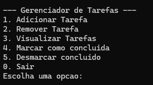
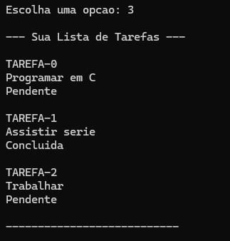
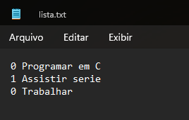

# Gerenciador de Tarefas (to-Do-List) em C

Este projeto é um gerenciador de tarefas (To-Do List) feito em linguagem C, utilizando lista ligada para armazenar as tarefas dinamicamente.

É utilizado um arquivo `.txt` para o salvamento da lista.

## Funcionalidades

- Adicionar tarefa ao final, início ou em uma posição específica
- Remover tarefa do final, início ou de uma posição específica
- Visualizar todas as tarefas e seus status (concluída ou pendente)
- Marcar e desmarcar tarefas como concluídas
- Liberação automática de memória ao sair
- Salvamento automático das tarefas em arquivo `.txt` e carregamento ao iniciar o programa

## Salvamento e Carregamento Automático

Todas as tarefas são salvas automaticamente no arquivo `lista.txt` ao sair do programa.  
Quando você executa o gerenciador novamente, suas tarefas são carregadas desse arquivo, permitindo continuar de onde parou.

- O arquivo `lista.txt` é criado na mesma pasta do executável.
- Cada linha do arquivo representa uma tarefa, indicando se está concluída ou não e sua descrição.
  
## Estrutura do Projeto

```
.
├── include/
│   └── tarefas.h
├── src/
│   ├── main.c
│   └── tarefas.c
├── Makefile
├── lista.txt
```

## Como compilar

No terminal, execute:

```sh
mingw32-make
```
ou, se estiver em Linux:

```sh
make
```

## Como executar

No Windows:
```sh
.\gerenciador_tarefas
```
No Linux:
```sh
./gerenciador_tarefas
```

## Uso

O programa apresenta um menu interativo para gerenciar suas tarefas. Basta seguir as instruções na tela para adicionar, remover, visualizar ou marcar tarefas.

## Exeplos

### Menu principal


### Visualização da lista após modificações



### Visualização do arquivo lista.txt



## Contribuição

Sinta-se à vontade para abrir issues ou pull requests com sugestões, correções ou melhorias!

